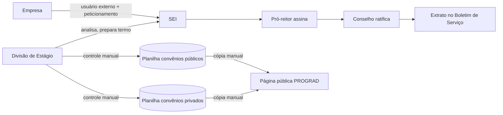
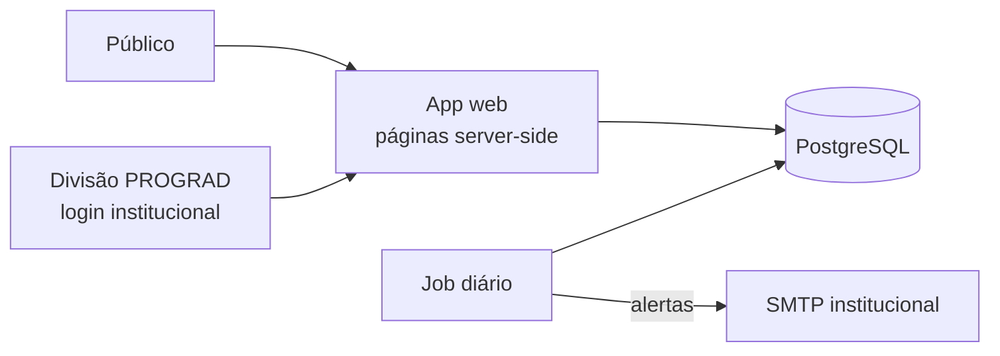
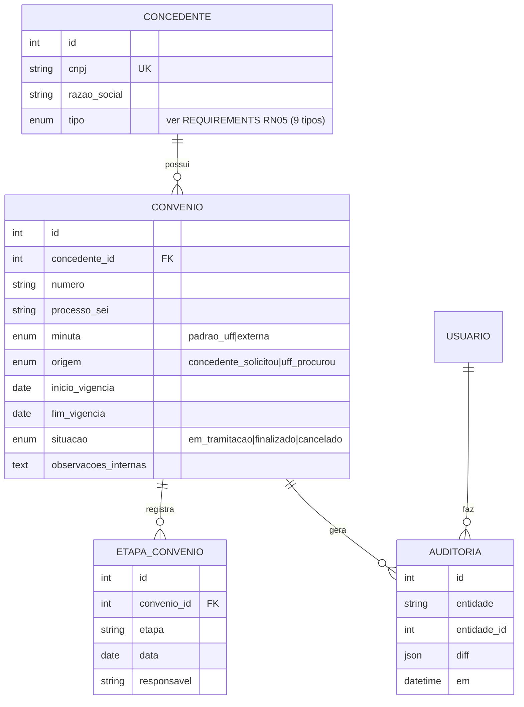

# ARCHITECTURE — Sistema de Estágios UFF

## 1. Arquitetura atual

Código: esqueleto Django (Fase 0). `config/` guarda as configurações (todas lidas de variáveis de ambiente) e `core/` tem o `/health/`. Os testes ficam em `tests/` e o pipeline em `tools/ci.py`.

O processo de negócio hoje roda sobre:

Problemas: dados duplicados em planilhas e site, nenhum alerta de vencimento, sem trilha de auditoria, barreira alta para empresa (cadastro externo no SEI).

## 2. Arquitetura proposta (MVP)

Monólito web simples, relacional. Sem microsserviços, sem fila, sem motor de workflow genérico: o volume (~2.000 convênios) não justifica.

- **App web**: renderiza páginas no servidor (área interna + página pública). Evita SPA separada no MVP.
- **PostgreSQL**: dados relacionais; regras com constraint de banco quando possível.
- **Job diário**: calcula vencimentos e envia alertas.
- **Arquivos** (Fase 2): armazenamento de objetos (MinIO ou disco da UFF), metadados no banco.

Por que relacional e não Firestore: entidades fortemente ligadas (concedente → convênio → estágio → TCE → aditivos), agregações para painéis e regras como "soma de vigência ≤ 24 meses" são SQL simples; custo previsível e dados sob controle da UFF (LGPD).

## 3. Modelo de dados (MVP)

- "Vigente/vencido/vencendo" é **derivado** de `situacao = finalizado` + datas — não é armazenado.
- Campos públicos: lista fixa em configuração no MVP (definida em D2). Se a PROGRAD precisar mudar com frequência, vira tabela editável.

## 4. Autenticação e autorização

- MVP: só usuários da Divisão, via login institucional (D6). Um papel: `divisao`. Página pública sem login.
- Fase 2: gov.br (OIDC) para externos; papel `representante` vinculado a CNPJ após validação da Divisão.

## 5. Transversais

- **Configuração**: variáveis de ambiente; segredos nunca no repositório (`.env.example` sem valores).
- **Erros**: validação no formulário + constraint no banco; erro inesperado gera log e página genérica.
- **Logs**: stdout estruturado, coletado pela infraestrutura da STI.
- **Testes**: ver STEPS.md e quality gate.
- **Ambientes**: dev (local, container Postgres), homologação (STI, com a Divisão), produção (STI).

## 6. Decisões

| # | Decisão | Status |
|---|---|---|
| A1 | Banco relacional PostgreSQL | Proposta (consenso do brainstorming) |
| A2 | Monólito com páginas server-side; SPA só se a interface exigir | Proposta |
| A3 | Django 5.2 LTS (admin pronto cobre a interface interna do MVP; auth/ORM/migrações nativos) | Decidida em 06/10/2026 |
| A6 | Ferramentas: uv, ruff, mypy strict, vulture, pip-audit, pytest-django; pipeline único em `tools/ci.py` | Decidida |
| A4 | SEI permanece processo oficial; sistema guarda nº do processo | Provisória — D1 |
| A5 | Status de vigência derivado de datas | Proposta |

## 7. Pontos de crescimento

TCE e estágios (entidades novas ligadas a CONVENIO), integração com acadêmico, assinatura gov.br, integração SEI/SDC. O modelo de concedente/convênio é a base de tudo isso, por isso vem primeiro.

## 8. Riscos e débitos

- Dados de planilha inconsistentes (CNPJ faltando, datas em texto) — mitigação: importação com relatório de rejeitos.
- Dependência do SEI indefinida (D1) — pode mudar a Fase 2.
- Rotatividade da equipe (bolsistas, servidor de passagem até novembro) — mitigação: documentação viva e testes.
