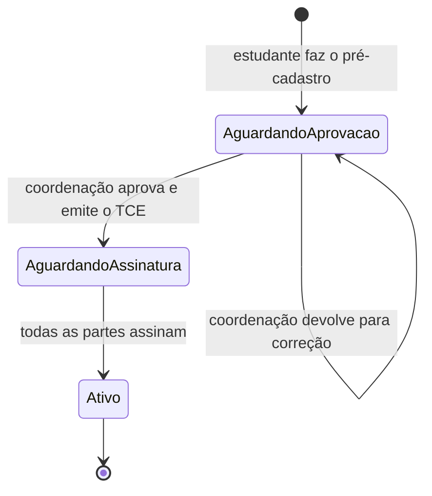

# REQUIREMENTS — Sistema de Estágios UFF

> Fontes: briefing técnico (SGE/SIGE, base Lei 11.788/2008 e páginas da PROGRAD), brainstorming da equipe e reunião Estágios@PROGRAD de 05/10/2026.
> Estado do projeto em 06/10/2026: **nenhum código existe**. Tudo abaixo está **pendente**.

## 1. Objetivo

Substituir o controle disperso (planilhas internas de convênios públicos e privados, página estática no site, e-mails, peticionamento no SEI) por um sistema único que:

1. Controle o ciclo de vida dos convênios de estágio com alertas proativos de vencimento.
2. Publique automaticamente os convênios vigentes (com campos seletivos definidos pela PROGRAD).
3. Reduza a barreira de entrada de empresas e instituições públicas na solicitação de convênio.
4. Em fases posteriores, conduza o TCE, aditivos, relatórios e encerramento do estágio.

Diretriz da reunião: **separar o "o quê" do "como"**. O "o quê" do processo atual se mantém; o "como" pode mudar. Entregas pequenas e frequentes (ágil); primeiro micropasso é o módulo de convênios.

## 2. Usuários

| Perfil | Fase em que entra | Papel |
|---|---|---|
| Divisão de Estágio / PROGRAD | MVP | Única com escrita no MVP. Cadastra e acompanha convênios, define o que é público, recebe alertas. |
| Público (qualquer pessoa) | MVP | Consulta convênios vigentes. |
| Concedente / Agente de Integração (externo) | Fase 2 | Solicita convênio e envia documentos via gov.br. |
| Estudante | Fase 3+ | Consulta, submete TCE, relatórios. |
| Coordenação de curso / Orientador / Supervisor | Fase 3+ | Aprovação e assinatura de TCE e plano de atividades. |
| SDC (arquivo da UFF) | Futuro | Guarda histórica legal dos documentos. |

## 3. Requisitos funcionais

### Alta prioridade — MVP (Fase 1: convênios internos)

| ID | Requisito | Status |
|---|---|---|
| RF01 | Cadastrar convênio: concedente (razão social, CNPJ, tipo — ver RN05), nº do convênio, nº do processo SEI, modalidade de minuta (padrão UFF / externa), datas de início e fim de vigência, situação, observações internas. | Implementado (1a) |
| RF02 | Registrar o andamento interno do processo (etapas: documentação recebida, análise, termo preparado, assinatura concedente, assinatura pró-reitor, ratificação, publicação do extrato no BS, finalizado). | Implementado (1a) |
| RF03 | Marcar, por campo, o que é público. Definição pela PROGRAD. Hoje é fixa no template, espelhando o site atual; CPF nunca é público. | Implementado (1c) |
| RF04 | Página pública com convênios vigentes, com busca por nome/CNPJ/tipo. Convênio entra na página automaticamente ao ser finalizado. | Implementado (1c) |
| RF05 | Alertas de vencimento para a Divisão (e-mail e painel), com antecedências configuráveis. | Pendente |
| RF06 | Painéis estratégicos: vigentes, encerrados/vencidos, vencendo em 30/90/180 dias, em tramitação, por tipo de concedente. Visibilidade (pública/privada) definida pela PROGRAD. | Pendente |
| RF07 | Importar os dados atuais das planilhas (públicos e privados) e da página do site. | Pendente |
| RF08 | Histórico de alterações de cada convênio (quem, quando, o quê). | Implementado (1a) |

### Média prioridade — Fase 2 (entrada externa)

| ID | Requisito | Status |
|---|---|---|
| RF09 | Login de usuário externo via gov.br (login único); primeira entrada gera pré-cadastro. | Pendente |
| RF10 | Divisão valida o pré-cadastro e vincula a pessoa como representante do CNPJ. | Pendente |
| RF11 | Representante solicita convênio com checklist dinâmico de documentos por tipo de proponente e upload. | Pendente |
| RF12 | Divisão analisa a documentação e, aprovada, abre o processo no SEI (manualmente no início). | Pendente |
| RF13 | Proponente acompanha o andamento da solicitação. | Pendente |
| RF14 | Fluxo interno distinto para convênios iniciados pela UFF (instituições públicas). | Pendente |

### Baixa prioridade / futuro (Fases 3+)

- TCE + Plano de Atividades com validações automáticas; assinatura em cadeia (gov.br).
- Termos aditivos, relatórios semestrais com lembrete, rescisão e Termo de Realização.
- Integração com sistema acadêmico (matrícula ativa, pré-requisitos, horários).
- Assinatura eletrônica gov.br de convênios dentro do sistema.
- Integração com SEI e transferência ao arquivo (SDC).
- Publicação de vagas pela concedente.

## 4. Regras de negócio

Aplicáveis ao MVP:

- RN01 — Convênio aparece na página pública quando finalizado e com vigência em curso ou a iniciar; o "a iniciar" leva selo "A partir de dd/mm/aaaa" (D18).
- RN02 — Convênio com fim de vigência passado muda para "vencido" automaticamente (derivado da data, não editado à mão).
- RN03 — CNPJ válido (dígito verificador) e único por concedente. Aceita o CNPJ alfanumérico da Receita (emitido desde julho de 2026).
- RN04 — Apenas a Divisão de Estágio escreve no MVP (grupo "Divisão de Estágio"). Convênio e concedente não são excluídos: convênio errado vira "cancelado".
- RN06 — Concedente identificada por CPF (pessoa física, ex.: profissional liberal) ou CNPJ, com dígito verificador validado. *Premissa, D14.*
- RN07 — Vigência do convênio de no máximo 5 anos. *Premissa, D15.*
- RN05 — Tipos de convênio (lista oficial do formulário atual da PROGRAD): Instituição de Ensino Privada; Empresa Privada; ONGs e OSCIPs; Órgãos dos Governos Federal, Estadual e Municipal; Profissional Liberal; Agente de Integração; Instituições de Ensino Públicas; Microempresas; Outros.

Para fases futuras (fonte: Lei 11.788/2008 e páginas da PROGRAD — confirmar com a Divisão antes de implementar):

- Jornada máxima 6h/dia e 30h/semana (graduação); estágio interno não obrigatório 4h/20h.
- Vigência máxima de 24 meses na mesma concedente, exceto estudante com deficiência.
- Recesso de 30 dias a cada 12 meses (proporcional).
- TCE só com convênio vigente da concedente ou de agente de integração conveniado.
- Apólice de seguro obrigatória no TCE; no obrigatório sem apólice da empresa, usar apólice institucional.
- Matrícula ativa como pré-condição para início e continuidade.
- Convênio com minuta externa exige ratificação pelos Conselhos Superiores.

## 4.0 Melhorias em relação ao SIGAA (requisito fundamental)

O SIGAA é a referência de fluxo (ARCHITECTURE A7), mas **superar as falhas dele é o motivo de existir deste sistema**. Cada fase precisa entregar as melhorias que lhe cabem, e cada uma tem critério de aceitação testável. As falhas de origem estão documentadas na seção 4.3.

| ID | Falha no SIGAA | Melhoria exigida | Critério de aceitação | Fase | Status |
|---|---|---|---|---|---|
| MS01 | A coordenação não fica sabendo de um novo pré-cadastro; o estudante precisa avisar por email | Quem tem a próxima ação recebe aviso automático (email e painel) | Toda mudança de etapa gera notificação ao responsável seguinte, verificada em teste | 2, 3 | Pendente |
| MS02 | SIGAA e SIPAC não se integram: o termo é baixado de um e enviado ao outro, nos dois sentidos | O documento é gerado, assinado e arquivado dentro do sistema | Nenhum passo do fluxo exige baixar e reenviar arquivo | 3, 4 | Pendente |
| MS03 | Assinantes externos precisam criar conta no SIPAC antes | O externo entra com gov.br, sem cadastro prévio | Supervisor ou concedente assina na primeira visita, só com gov.br | 2, 4 | Pendente |
| MS04 | Ninguém vê quem falta assinar (a dica oficial é o estudante assinar por último) | Todos os envolvidos veem o status de cada assinatura | Painel do processo lista assinado/pendente por parte, para todas as partes | 3 | Pendente |
| MS05 | É preciso começar com 10 dias de antecedência por causa da tramitação | O tempo de tramitação é medido e exibido, para poder ser reduzido | Painel mostra o tempo médio entre o pedido e a ativação | 1e, 3 | Pendente |
| MS06 | A consulta de convênio exige login no SIGAA | Qualquer pessoa ou empresa consulta os convênios vigentes sem login | Página pública sem login, com busca por nome, CNPJ e número | 1c | Implementado |
| MS07 | Empresa sem convênio só descobre o caminho por formulário perdido no site do curso | A página pública orienta como pedir convênio quando a busca não encontra nada | Busca sem resultado mostra o caminho para solicitar | 1c (texto), 2 (fluxo) | Parcial |

Ao propor ou revisar qualquer funcionalidade, verifique se ela reproduz uma dessas falhas. Se reproduzir, a falha vira item novo nesta tabela.

## 4.1 Campos do convênio no sistema atual (estagio.uff.br, Drupal)

Levantamento feito em 06/10/2026 a partir da página pública e do formulário "Editar Convenio". Ele descreve o sistema atual e não é uma decisão de modelo.

| Campo atual | Na página pública | Observação |
|---|---|---|
| Title (nome da concedente) | sim (título) | |
| Nº CONVÊNIO | sim | formato `PR-NNN/AAAA` |
| INICIO DO CONVENIO | sim | entra como `dd.mm.aa` |
| TÉRMINO CONVÊNIO | sim | entra como `dd/mm/aa` (formato diferente do início) |
| NÚMERO DO PROCESSO | sim | formato SEI `23069.NNNNNN/AAAA-DV` |
| ANO | sim | redundante com o nº do convênio e a data de início? |
| UF | sim | taxonomia |
| Cidade | sim | taxonomia |
| Tipo da Instituição | sim | taxonomia; substituída pelos 9 tipos da RN05 (D11), com os valores antigos mapeados na importação |
| Ramo de Atividade | sim | taxonomia, parece CNAE |
| Objeto (textarea curta) | sim | quase sempre um texto padrão |
| CNPJ | sim | entra sem máscara, a página exibe formatado |
| Objeto (corpo HTML grande) | não | costuma ficar vazio |
| PUBLICADO | não | status do convênio; substituído por `situacao` + vigência derivada (RN02) |
| Resolução CEP | não | número e link da norma interna da UFF que autorizou o convênio |
| Email | não | |

## 4.2 Referência externa: Central de Estágios do SIGAA (UFOB)

Fonte: guia do usuário v2.0 da UFOB (https://ufob.edu.br/acesso-a-informacao/convenios-e-transferencias/GuiaCentraldeEstgiosv.2.0.pdf). É o módulo de estágio do SIGAA, usado por várias federais. Lido em 06/10/2026. Nada aqui vale para a UFF sem confirmação da PROGRAD.

| Ideia do SIGAA | Uso proposto aqui | Fase |
|---|---|---|
| Concedente pode ser **pessoa física (CPF)** ou jurídica (CNPJ); o profissional liberal entra com CPF | Documento da concedente aceita CPF ou CNPJ (D14) | 1a |
| Vigência do convênio de no máximo 5 anos | Validação no cadastro (D15); o exemplo PR-212/2026 da UFF tem exatamente 5 anos | 1a |
| Razão social + nome fantasia; endereço completo; telefones | Nome fantasia ajuda na busca pública; endereço completo só quando houver termo gerado | 1a / 2 |
| Situações SUBMETIDO → RECUSADO (com motivo visível ao solicitante) → ANALISADO → APROVADO | Base da situação da solicitação externa | 2 |
| Checklist de documentos e representante legal com cargo e email | Base do RF11 | 2 |
| Âmbito nacional/internacional; flags agente de integração / órgão público | Avaliar com a PROGRAD | 2 |
| Estágio só fica ATIVO depois do upload do TCE assinado | Regra de ativação na fase do TCE | 3 |
| Aviso ao estudante 30 dias antes de completar 6 meses ou do fim | Regra de notificação dos relatórios | 3 |
| Aditivo não pode deixar lacuna entre a vigência anterior e a nova | Validação do aditivo | 3 |
| Certificado do supervisor ao fim do estágio | Funcionalidade candidata | 3+ |
| Oferta de vagas pela concedente e/ou coordenação | Já previsto como futuro | 4 |

## 4.3 Referência externa: início de estágio no SIGAA (UFRN)

Fontes (06/10/2026): BPMN "Cadastramento de Estágio Obrigatório", "Tutorial para Pré-Cadastro de Estágio" (UFRN, 2021) e "Passo a Passo – Início de um Estágio" (SAIGAD/UFRN). Servem de base para a Fase 3 e não valem como regra da UFF sem confirmação.

**Fluxo de referência (pré-cadastro → TCE ativo):**

Assinam o TCE: estudante, professor orientador, coordenação do curso, supervisor e responsável pela concedente ou pelo local. Na UFRN, a assinatura acontece no SIPAC (eletrônica) ou em papel.

**Dados do pré-cadastro:** convênio (busca por nome, CNPJ, responsável ou número); tipo (obrigatório ou não obrigatório); carga horária semanal (≤ 30 h, ou ≤ 40 h se o curso alterna teoria e prática e o PPC prevê); valor da bolsa e do auxílio-transporte por dia (obrigatórios no estágio não obrigatório); professor orientador; **local de estágio** (CNPJ, nome e endereço da unidade) e setor; responsável pelo local; supervisor (formação na área ou experiência comprovada; pode ser cadastrado na hora); horários por dia, sem choque com as aulas; seguro (seguradora, apólice, valor e cópia; no obrigatório a universidade custeia); vigência; plano de atividades.

**Pontos que afetam o nosso modelo:**
- **Concedente não é o mesmo que local de estágio.** Exemplo: o convênio é com a Secretaria Estadual de Educação, e o estágio acontece numa escola. O estágio precisa dos dois.
- Agentes de integração (CIEE, IEL...) são selecionados como o convênio do estágio não obrigatório.

**Falhas do SIGAA que o nosso sistema deve evitar:**
- A coordenação não recebe aviso de novo pré-cadastro; o estudante precisa mandar email.
- SIGAA e SIPAC não se integram: o termo é baixado de um sistema e enviado ao outro à mão, nos dois sentidos.
- Assinantes externos precisam se cadastrar antes no SIPAC (barreira de entrada; aqui seria o gov.br).
- O estudante não sabe quem ainda falta assinar (a orientação é assinar por último para ver os pendentes).
- É preciso pré-cadastrar com 10 dias de antecedência por causa dessa tramitação.

**Guarda de documentos:** na UFRN, o TCE físico fica arquivado na coordenação por 52 anos. Perguntar ao SDC qual é o prazo na UFF (D9).

## 5. Requisitos não funcionais

- RNF01 — Dados pessoais tratados conforme LGPD; hospedagem na infraestrutura da UFF.
- RNF02 — Login institucional para usuários internos; gov.br para externos (Fase 2).
- RNF03 — Trilha de auditoria em toda alteração de convênio.
- RNF04 — Página pública acessível (WCAG AA básico) e responsiva.
- RNF05 — Volume de referência: ~2.000 convênios ativos; ~60 mil estudantes nas fases futuras.
- RNF06 — Documentos em armazenamento de objetos; banco guarda só metadados.
- RNF07 — Backup diário do banco e dos documentos.

## 6. Critérios de aceitação do MVP

- Divisão cadastra, edita e consulta convênio sem planilha paralela.
- Ao marcar "finalizado", o convênio aparece na página pública sem passo manual, exibindo só os campos marcados como públicos.
- Usuário não autenticado não acessa campos internos (teste automatizado).
- Alerta é enviado nas antecedências configuradas; teste com data simulada.
- Painel mostra contagens que batem com consulta direta ao banco.
- Dados das planilhas atuais importados com relatório de linhas rejeitadas.

## 7. Fora do escopo atual

TCE e ciclo do estágio, integração com sistema acadêmico, assinatura digital, integração automática com SEI e SDC, vagas, app móvel.

## 8. Dúvidas e decisões pendentes

| # | Dúvida | Alternativas | Quem decide |
|---|---|---|---|
| D1 | O processo de convênio precisa obrigatoriamente tramitar no SEI? | (a) SEI continua sendo o processo oficial, sistema só controla; (b) sistema abre processo no SEI via API; (c) migrar fluxo para fora do SEI. Consenso provisório: trabalhar em paralelo, Divisão abre o processo no SEI. | PROGRAD + STI |
| D2 | Quais campos do convênio são públicos? | Lista atual do site como ponto de partida. | PROGRAD |
| D3 | Antecedências dos alertas de vencimento? | 12, 6, 3 e 1 mês (sugestão da reunião: "um ano, seis meses"). | PROGRAD |
| D4 | Quais painéis são públicos? | STI sugere público; PROGRAD decide. | PROGRAD |
| D5 | ~~Stack~~ Django decidido em 06/10/2026. Hospedagem: padrão da STI? | — | STI |
| D6 | Login: gov.br ou idUFF (provável), a definir. | Até lá, login nativo do Django; o escolhido entra como backend de autenticação sem reestruturar. | STI |
| D7 | Etapas exatas do processo interno, nos dois modelos (empresa procura UFF / UFF procura instituição pública). | Passo a passo prometido pela Divisão. | PROGRAD |
| D8 | Formato e qualidade das planilhas atuais (colunas, duplicatas). | — | PROGRAD envia cópia |
| D9 | Exigências do SDC sobre guarda de documentos. | Aguardar participação do SDC. | SDC |
| D11 | ~~Qual vocabulário de tipo vale?~~ **Resolvida em 06/10/2026: os 9 tipos da RN05.** Falta a tabela de-para dos tipos do Drupal para a importação (1b). | — | PROGRAD |
| D12 | Ramo de Atividade é o CNAE? | (a) CNAE oficial; (b) lista própria | PROGRAD |
| D13 | ~~PUBLICADO e Resolução CEP~~ resolvidas em 06/10/2026 (ver 4.1). Pendente: o Objeto padrão pode virar o valor sugerido? A Resolução CEP é pública? | — | PROGRAD |
| D14 | ~~CPF para profissional liberal?~~ **Premissa adotada em 06/10/2026:** concedente aceita CPF ou CNPJ, como no SIGAA (mesma legislação federal). Confirmar com a PROGRAD. | — | PROGRAD |
| D15 | ~~Vigência máxima de 5 anos?~~ **Premissa adotada em 06/10/2026:** o cadastro bloqueia vigência acima de 5 anos. Confirmar com a PROGRAD. | — | PROGRAD |
| D16 | ~~Adotar o SIGAA?~~ **Resolvida em 06/10/2026:** a UFF não tem acesso ao SIGAA. Seguimos com sistema próprio, usando a Central de Estágios do SIGAA como referência de fluxo (seção 4.2). | — | — |
| D17 | O histórico (RF08) precisa mostrar o valor anterior de cada campo, ou basta saber quem mudou, quando e quais campos? | (a) basta o histórico nativo do admin (atual); (b) adotar django-simple-history | PROGRAD |
| D18 | ~~Convênio "a iniciar" na página pública?~~ **Resolvida em 06/10/2026:** aparece, com selo "A partir de dd/mm/aaaa". | — | — |
| D10 | Credenciamento gov.br da UFF para login único (Fase 2) já existe? | — | STI |
